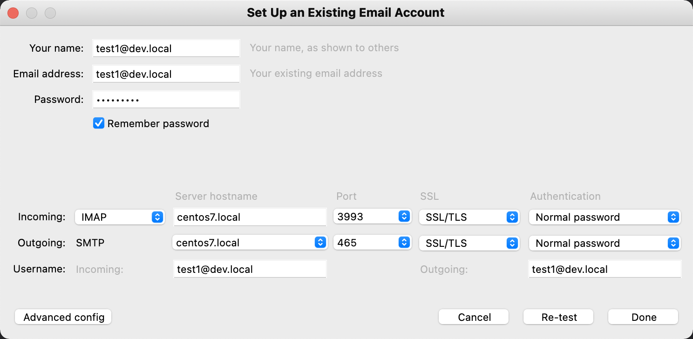

# Mail Server Factory

Version information:

- [Current version](./version.txt)
- [Current version code](./version_code.txt)
- [Releases](https://github.com/Server-Factory/Mail-Server-Factory/releases).

# About the project

The purpose of the Mail Server Factory project is to provide a simple way for the end-user to easily set up and run its
mail server. The end-user writes the configuration as a simple JSON which is then interpreted and understood by the Mail
Server Factory. Mail Server Factory performs various installations and initializations based on this JSON on the target
operating system. Mail server stack that is deployed on the target operating system runs
on [Docker](https://www.docker.com/). Each stack component is loosely coupled which creates a solid base for further /
future scalability.

# System requirements

To be able to run Mail Server Factory the following system requirements must meet:

- Modern computer (or server) as a hardware
- [OpenJDK](https://openjdk.java.net/)
- [Gradle](https://gradle.org/) build system

# Compatibility

Mail Server Factory supports the following target operating systems:

- CentOS Server 7 and 8
- Fedora Server versions: 30 to 33
- Fedora Workstation versions: 30 to 33
- Ubuntu Desktop 20

*Note:* Many other operating systems will be supported in upcoming releases.

# Specifications

Installed mail server will be delivered with the following technology stack:

- [Docker](https://www.docker.com/) for running all stack services containers
- [PostgreSQL](https://www.postgresql.org/) for the main database
- [Dovecot](https://www.dovecot.org/) and [Postfix](http://www.postfix.org/) as the main mail services
- [Rspamd](https://www.rspamd.com/) for the anti-spam service
- [Redis](https://redis.io/) as in-memory database for [Rspamd](https://www.rspamd.com/) service
- [ClamAV](https://www.clamav.net/) for the anti-virus service.

*Note:* The mail server will use self-signed certificates for encrypting the communication. For this purpose proper CA
will be configured on the server.

# Web setup

Simply execute the following command:

```bash
/bin/bash -c "$(curl -fsSL https://raw.githubusercontent.com/Server-Factory/Utils/master/web_installer.sh)"
```

Mail Server Factory will be downloaded and installed.

# Hot to use

[Examples](./Examples) directory contains examples of JSON configuration(s) for Mail Server Factory deployment(s).
Detailed explanations for every configuration variable will be provided in upcoming releases.

To run Mail Server Factory simply execute the program and pass to it path to the configuration JSON file.
For Instance:

```bash
mail_factory Examples/Centos_8.json 
```

or (if you are using Java .jar):

```bash
java -jar Application/build/libs/Application.jar Examples/Centos_8.json
```

The current version of Mail Server Factory performs SSH access to target hosts using keys. For enabling SSH access using
keys the [following bash script](Core/Utils/init_ssh_access.sh) can be used.

Example of `init_ssh_access.sh` script use:

```bash
sh Core/Utils/init_ssh_access.sh centos7.local
```

A detailed explanation of the script can be found [here](https://github.com/Server-Factory/Utils) under
"SSH login without password" section.

*Note:* We strongly recommend the clean installation of the server operating system to be used with Mail Server Factory so
there is no conflict of any kind with existing software or services.

## Using installed mail server

After the mail server is installed the following Docker services will be running:

Tbd.

Example configuration for one of the installed email accounts on the Mozilla Thunderbird client:



*Note:* Pay attention to custom port numbers!

## Mail Server Factory in action

Tbd. (YouTube video)

# Cloning the project

To be able to read project source code or contribute it is required to clone the Git repository. The following command
clones the project and initializes all Git submodules:

```bash
mkdir Factory && cd Factory
git clone --recurse-submodules git@github.com:Server-Factory/Mail-Server-Factory.git .
```

## Building the project

To build the project cd into the directory where you have cloned the code and execute:

```bash
gradle wrapper
./gradlew assemble
```

*Note:* To be able to execute [Gradle](https://gradle.org/) commands, [Gradle](https://gradle.org/) must be installed on
your system.

## Running tests

To execute project tests cd into the directory where you have cloned the code and execute:

```bash
./gradlew test
```

*Note:* To be able to pass tests [Docker](https://www.docker.com/) must be installed on your system.

## Git submodules

A complete list of Git submodules used by the project can be found [here](./.gitmodules).